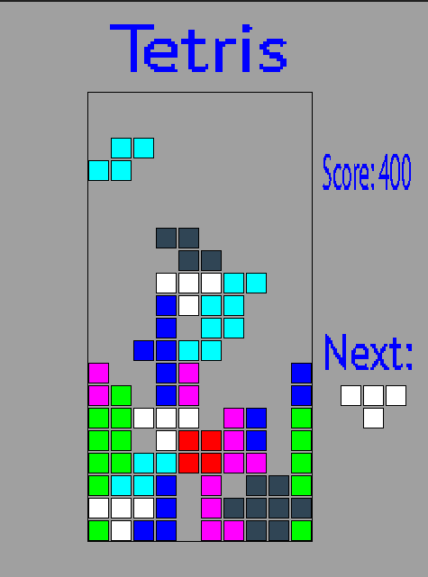

# C-Tetris

Simple tetris made with C and SDL2 under Linux.

1. Install `SDL2` and `SDL2-ttf` to build app.
2. Install `cmocka` to run tests
3. Run `make test` && `make build` && `make run`
4. Use arrow keys to move a figure and space to restart.